# Vehicle Detection Project

The goals / steps of this project are the following:

* Perform a Histogram of Oriented Gradients (HOG) feature extraction on a labeled training set of images and train a Linear SVM classifier
* Apply a color transform and append binned color features, as well as histograms of color, to your HOG feature vector. 
* Implement a sliding-window technique and use your trained classifier to search for vehicles in images.
* Run a pipeline on a video stream (start with the test_video.mp4 and later implement on full project_video.mp4) and create a heat map of recurring detections frame by frame to reject outliers and follow detected vehicles.
* Estimate a bounding box for vehicles detected.

## [Rubric](https://review.udacity.com/#!/rubrics/513/view) Points
### Here I will consider the rubric points individually and describe how I addressed each point in my implementation.  

---
### Histogram of Oriented Gradients (HOG)

#### 1. How and where in my code I extracted HOG features from the training images.

The `get_hog_features()` function in [lesson_functions.py](./lesson_functions.py) extracts HOG features from a training image.

I started by reading in all the `vehicle` and `non-vehicle` images.  Here is an example of one of each of the `vehicle` and `non-vehicle` classes:

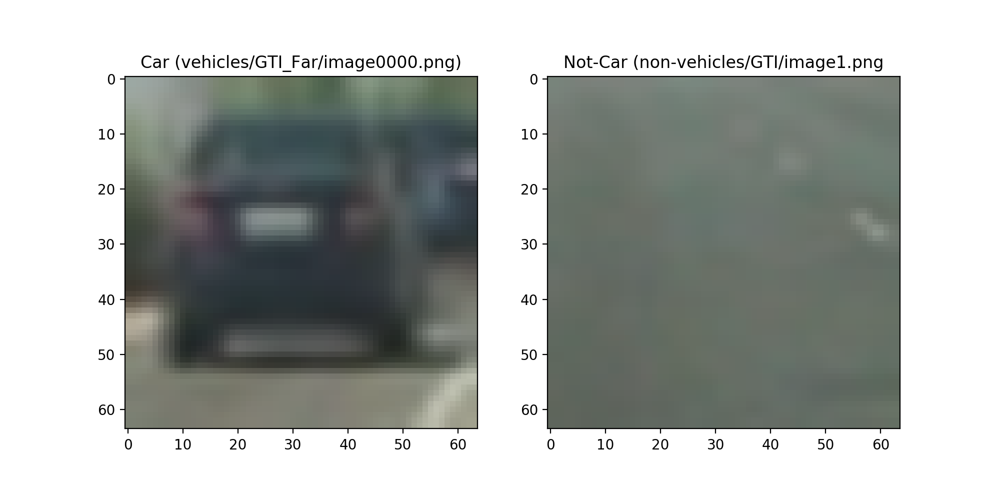

I grabbed random images from each of the two classes and displayed them to get a feel for what the `skimage.hog()` output looks like.

Here is an example using the `YCrCb` color space and HOG parameters of `orientations=9`, `pixels_per_cell=(8, 8)` and `cells_per_block=(2, 2)`:

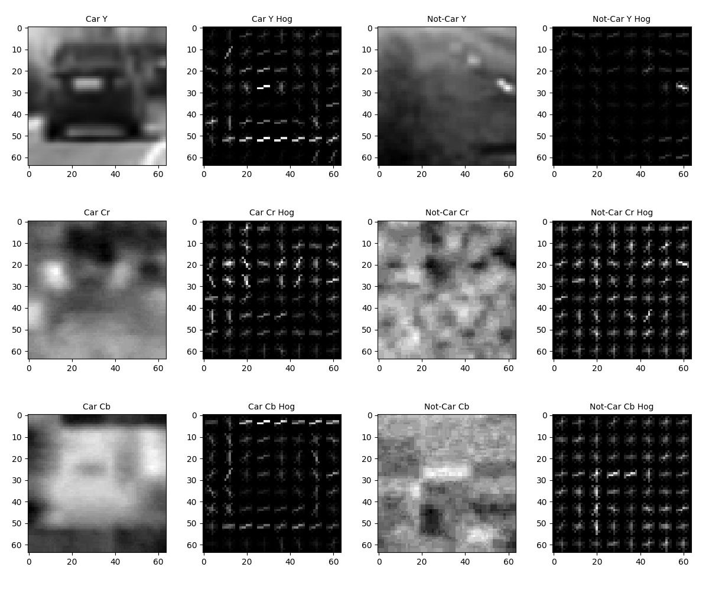

#### 2. How I settled on my final choice of HOG parameters.

My final choice of HOG parameters are:

| Parameter | Value |
|:----------|------:|
|Color Space | YCrCb |
|Orientation|9      |
|cells per block| (2, 2) |
|pixels per cell| (8, 8) |

I settle on these values for the following reasons:

1. These, combined with color features,  produced a reasonably high classification accuracy of 99% against test samples.
1. Since there is no easy way to know in advance if a classifier built with a specific combination of parameters will perform well when used to detect cars in the project video, I just decided to go with the same parameters used in `lesson_functions.py` as provided by the class. If my classifier failed to detect cars in the video, I could come back and try different parameters until I find one that works well.  Fortunately, the classifier built with the original parameters worked well, so I didn't need to try out others. There probably is a better and/or faster set of parameters out there, but I did not have time to explore them.

#### 3. How and where in my code I trained a classifier using selected HOG and color features

The function `car_detector.build()` in [`car_detector.py`](./car_detector.py) builds a linear SVM from the following features:

| Feature | Parameter | Feature Length |
|:----------|:------|:-----|
|Binned Spatial| size=(32, 32)   | 3072 (= 32 width x 32 height x 3 channels) |
|Color Histogram| nbins=32, bin_range=(0, 256) | 96 (= 32 bins x 3 channels) |
|HOG| orient=9, cells per block=(2, 2), pixels per cell=(8, 8)| 5292 (= 9 x 2 x 2 x (64 / 8 - 2 + 1)²  x 3 channels )
|           |       | total: 8460|

Both GTI and KTTI car and non-car image samples were used. There were 8792 car samples and 8968 non-car samples in total.

I did not apply any pre-processing to them. I was fully aware that some of the images were too similar to others (which may cause over-fitting), but I simply decided to ignore that concern.

20% of all samples were set aside as a test set. 

Each sample was converted to YCrCB space, and all three channels were used to extract the aforementioned features.

The final classifier achieved 99.01% classification accuracy against the test set.

### Sliding Window Search

#### 1. How and where in my code I implemented a sliding window search.  How I decided what scales to search and how much to overlap windows.

The main algorithm for this step is implemented in the function `car_detector.find_cars()` in [`car_detector.py`](./car_detector.py). The function, which performs HOG sub-sampling window search, was copied from the code provided by the class.

The function is invoked in the video processing pipeline with the following parameters:

| Parameter | Value(s) |
|:----------|:------|
| scaling | [1.0, 1.5, 2.0] |
| scanned region of image | x = [0, 1280), y = [400, 656) |
| sliding increments | 2 pixels (controlled by cells_per_step param; effectively 75% overlap since window size is 8x8) |

The video processing pipeline calls the function `frame_tracker.process_frame()` in [`process_video.py`](./process_video.py) for each frame, and the function calls `car_detector.find_cars()` to find bounding boxes that most likely contain cars.

I manually tried different scaling values, and settled on those values because they had the best false-positive vs false-negative tradeoff. The classifier almost never missed cars while only occasionally mis-identifying things which are not cars as cars.

I used the same sliding window increment (2 pixels) as used in the original code. Increasing the value would have speeded up processing, but I left it at the default value since my computer was reasonably fast to process the entire length of the project video (in aprox. 30 min).

#### 2. Examples of test images to demonstrate how my pipeline is working and things I did to optimize the performance of my classifier.

Ultimately I searched on three scales using YCrCb 3-channel HOG features plus spatially binned color and histograms of color in the feature vector, which provided a nice result.  Here are some example images:
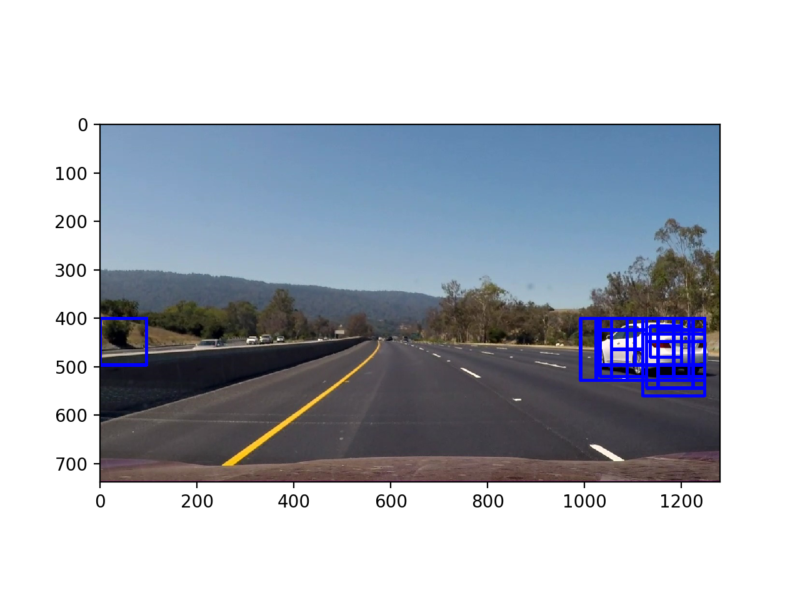 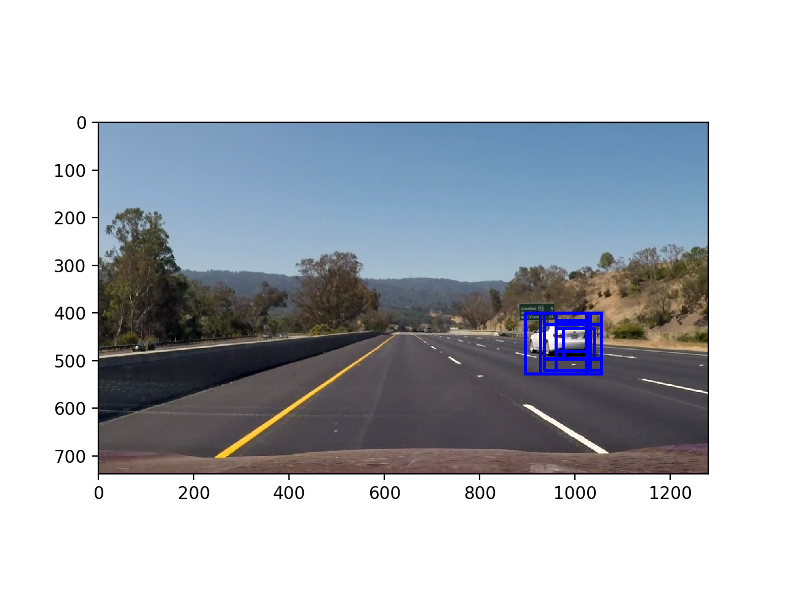
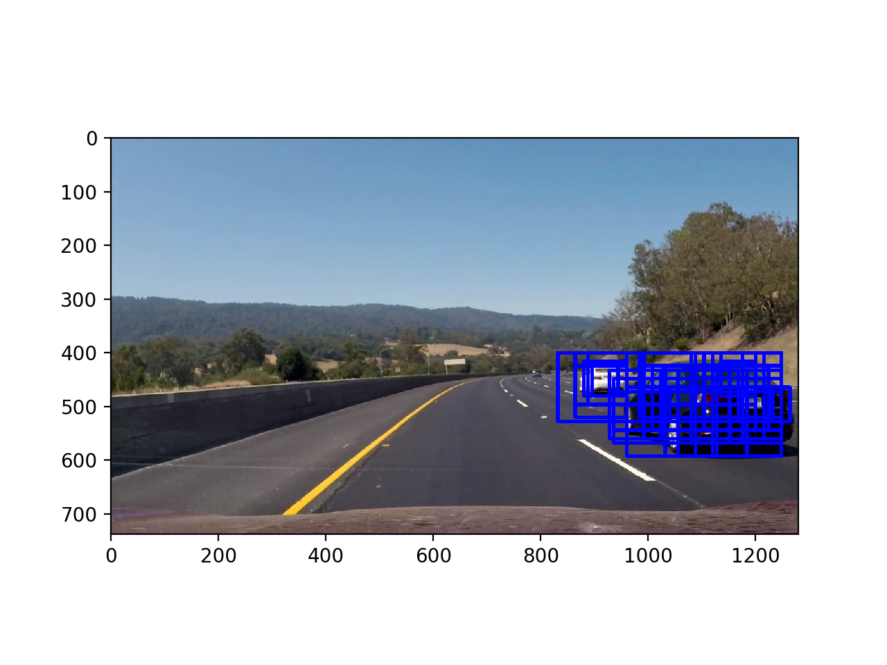 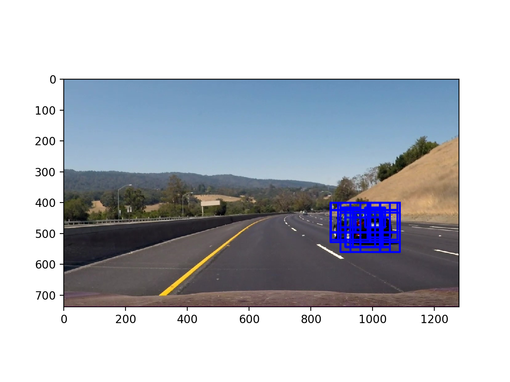

While I did not do much to optimize performance, here is a few I did:

1. Restricting the search region to y=[400, 656). Not only did this tremendously reduce false positives, it cut down processing time by half or even more.
1. Avoid using scaling values which are too small. Smaller scaling values caused far more false positives, so I decided not to use values less than 1.

---

### Video Implementation

#### 1. Link to video.
Here's a [link to my video result](./project_video_with_cars_detected.mp4)

#### 2. How and where in my code I implemented a kind of filter for false positives and some method for combining overlapping bounding boxes.

The `frame_tracker.process_frame()` function in [`process_video.py`](./process_video.py) implements the heat map algorithm that can simultaneously address the issues of overlapping bounding boxes and false positives.

For each frame, the pipeline does the following:

1. Detect bounding boxes which mostly likely contain cars.
1. Create a heat map from those bounding boxes. Each point on the heat map has the number that is equal to the number of bounding boxes that enclose it.
1. Store the heat map in a deque that keeps the most recent 10 heat maps.
1. Create an integrated heat map by summing up all the heat maps in the deque.
1. Threshold the integrated heat map. Any points that have a value less than or equal to 5 are zeroed out. Most false positives get eliminated this way.
1. Identify individual blobs in the integrated heat map with `scipy.ndimage.measurements.label()`. 
1. Construct bounding boxes to cover the area of each blob.

Here's an example result showing the heat map from a series of frames of video, the result of `scipy.ndimage.measurements.label()` and the final bounding boxes then overlaid on the last frame of video:

### Here are five frames and their corresponding heat maps:

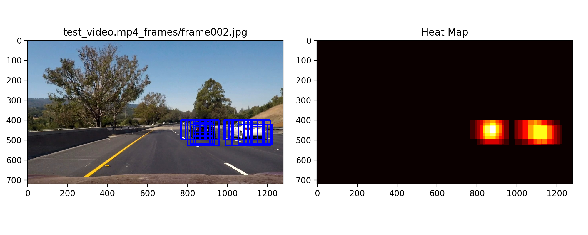

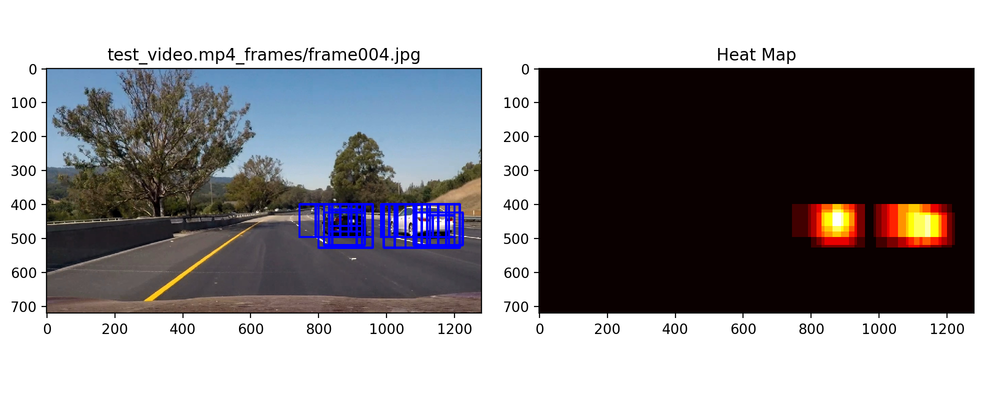
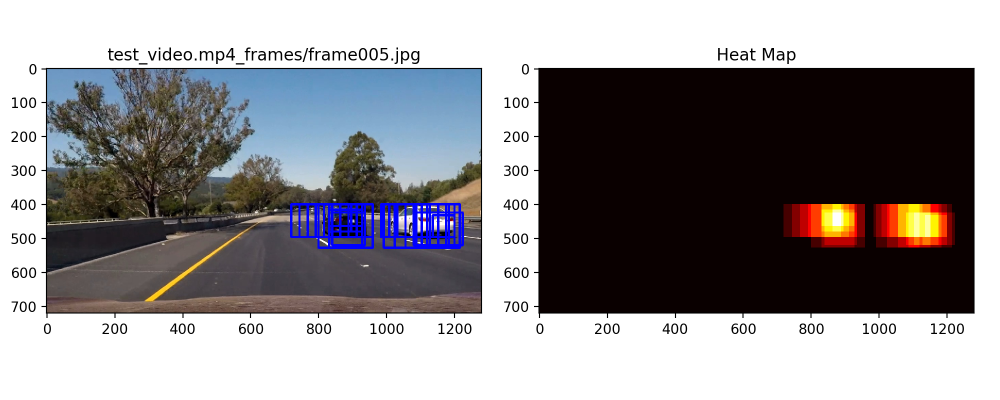

### Here is the output of `scipy.ndimage.measurements.label()` on the integrated heat map from all five frames:
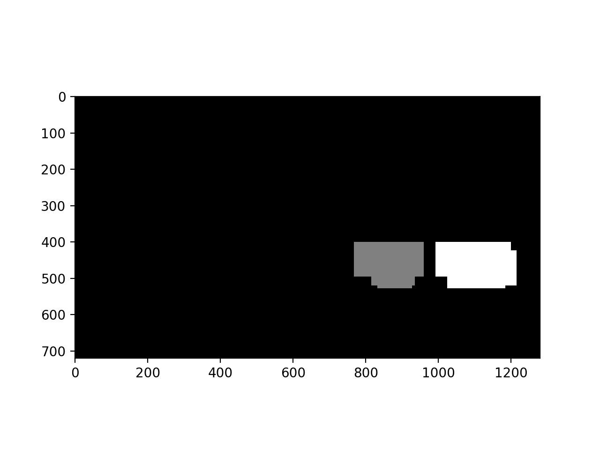

### Here the resulting bounding boxes are drawn onto the last frame in the series:
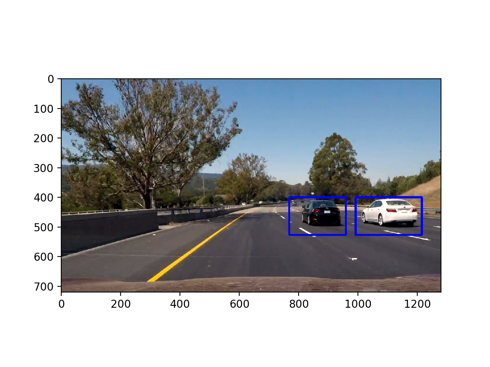
---

### Discussion

#### Issues Encountered:

1. Smaller scaling factors caused significantly more false positives. Because of this, I decided against using any values less than 1 (besides, smaller values take more time to process each frame.)
1. A car emerging from the right edge of the frame (i.e. a car passing our car on the right), is not detected immediately. A full 2/3 of its body length must be in the frame to be detected. I am not sure if this is acceptable. To detect them, I think I need to train our classifier with sample images that have only part of a car.

#### Conditions that most likely to cause the pipeline to malfunction.

1. Existence of vehicles which are not passenger cars (e.g. trucks, motorcycles, vintage cars, tractors)
1. Sub-optimal weather (rain, snow, fog)
1. Inclined roads
1. Billboards with an image of a car.
1. Traffic Congestion (severe occlusion of cars)

#### What could be done to make it more robust:
1. More training samples with wider variety of vehicles.
1. More sophisticated way to track vehicles.
